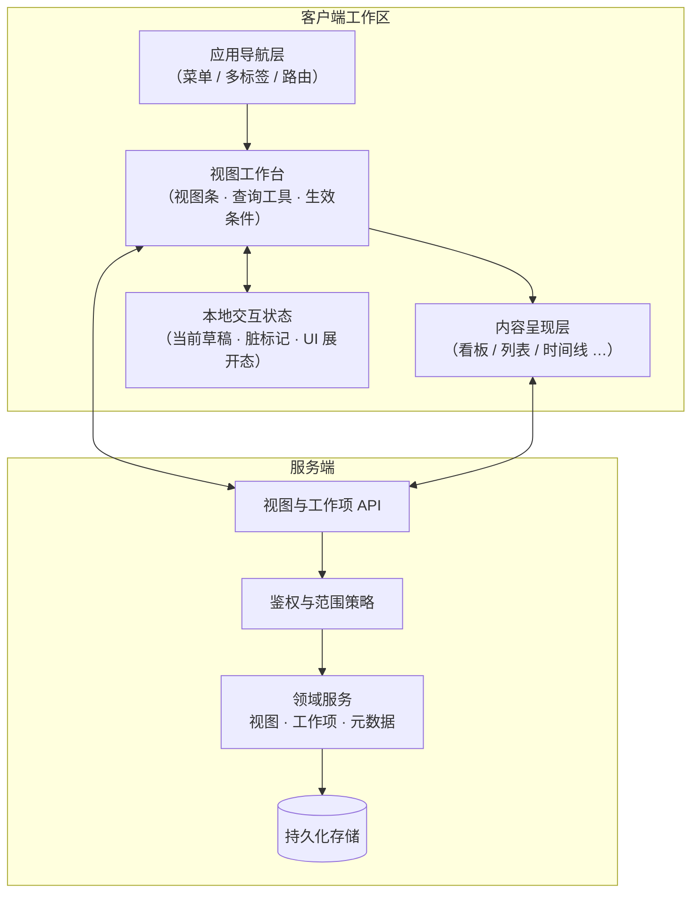
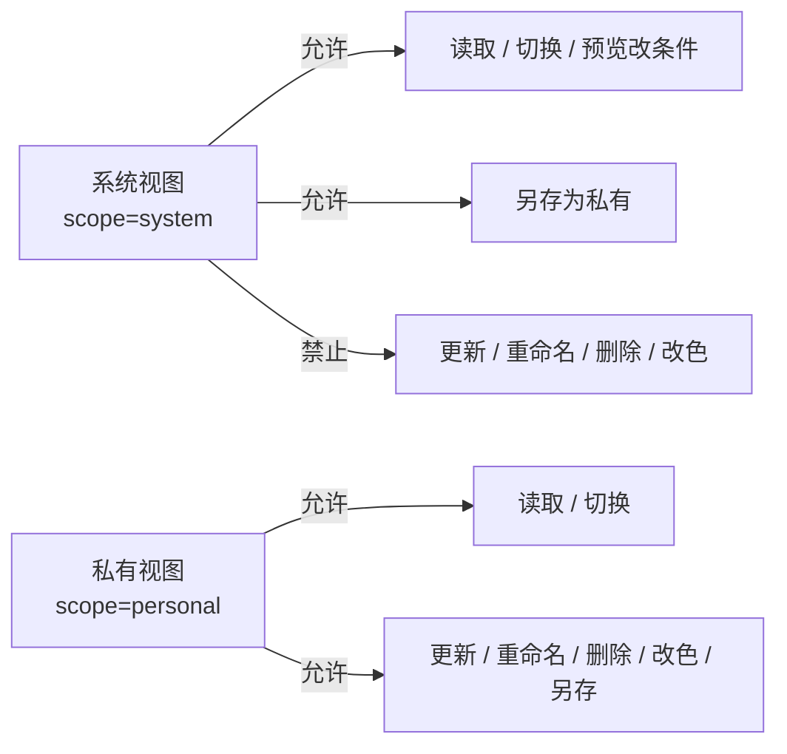
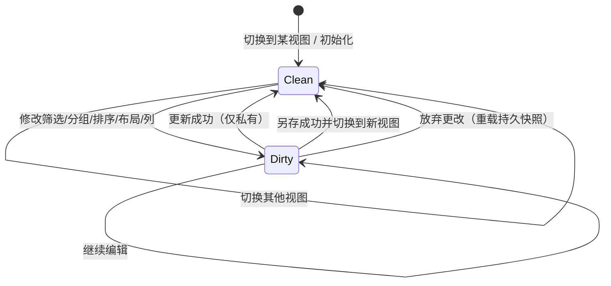
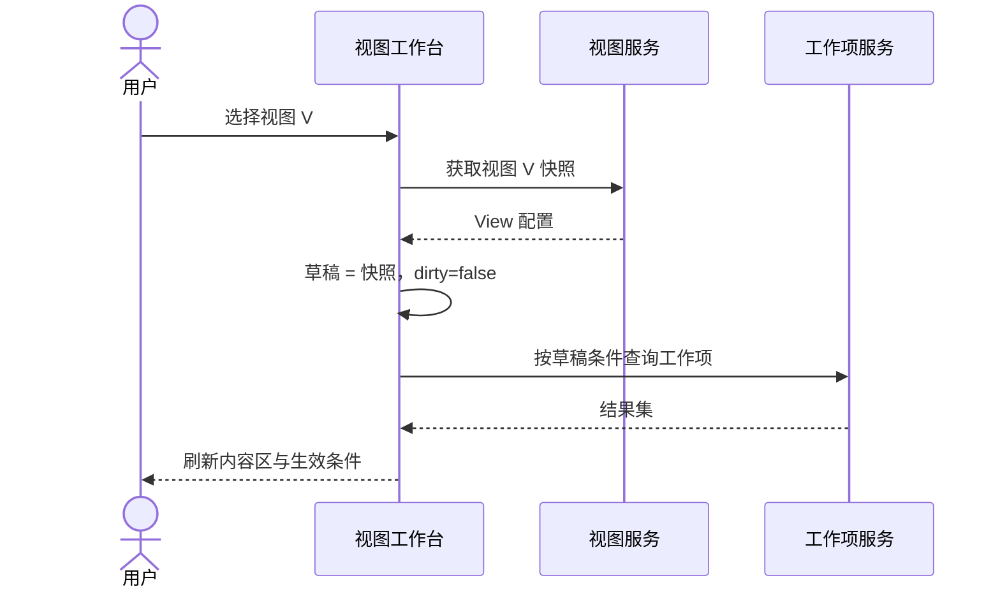
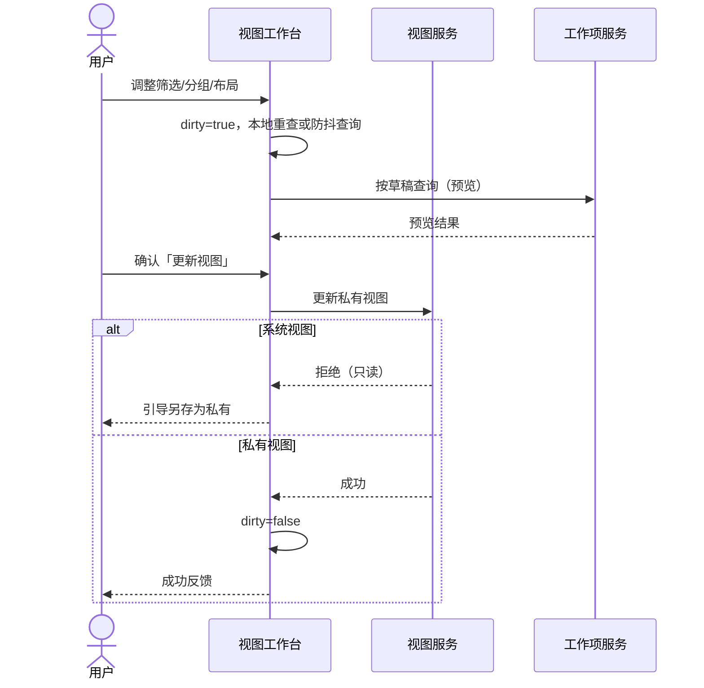
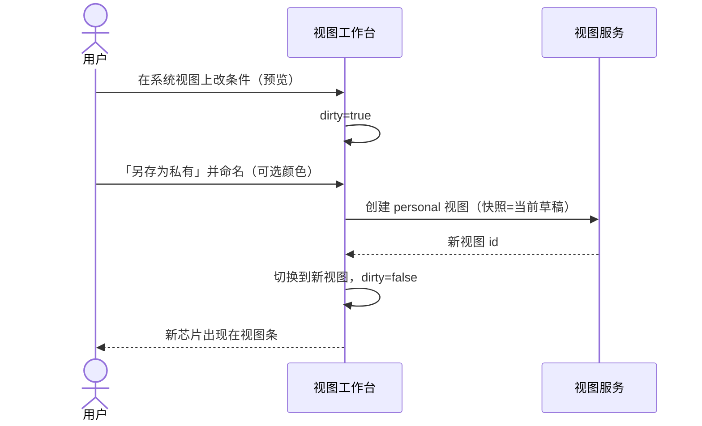
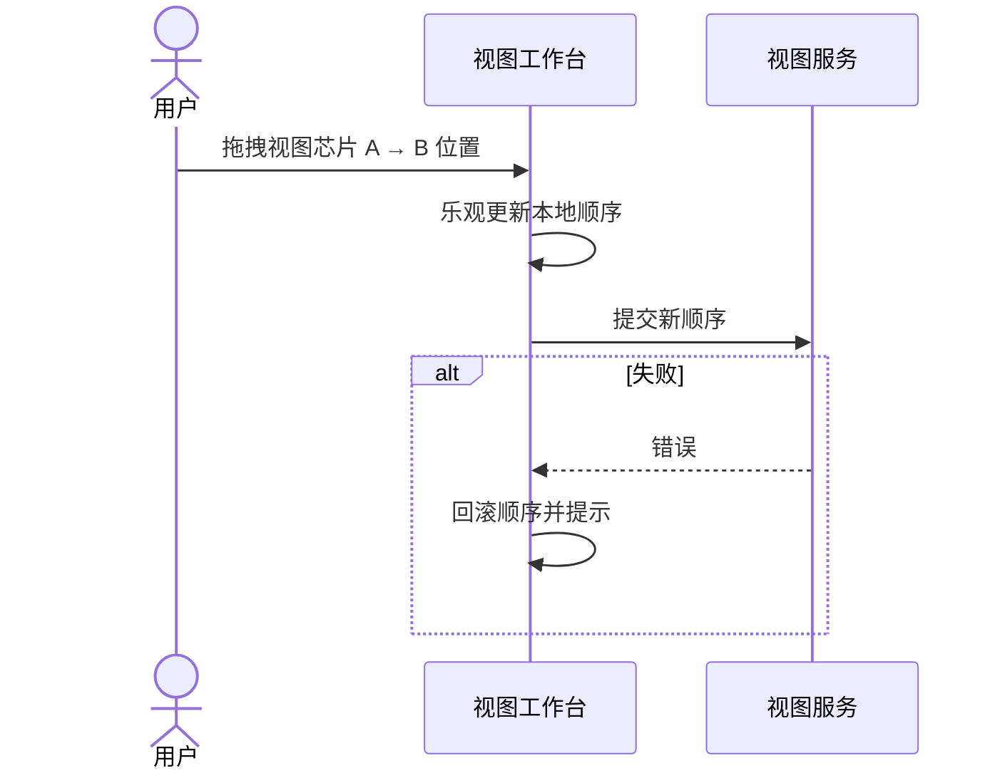
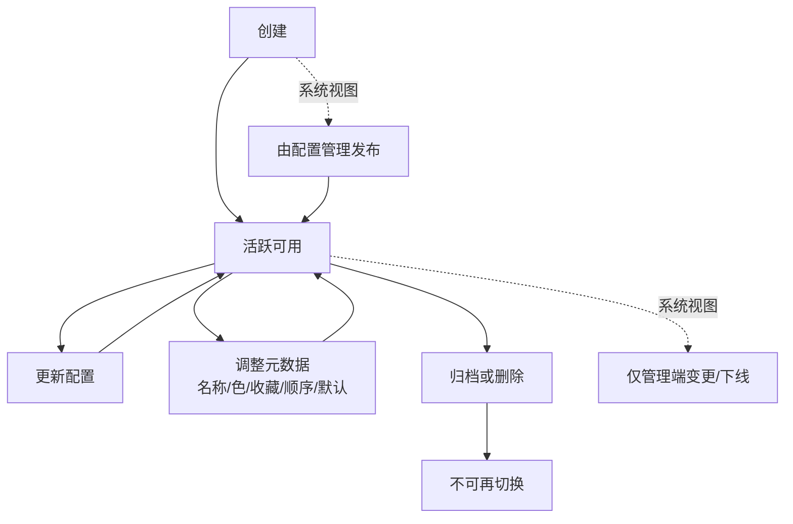
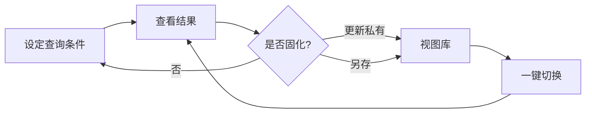

# 视图管理 — 研发文档

> 本文档描述「筛选视图管理」能力的产品目标与设计规划，面向产品、研发与测试评审。  
> 文档保持技术栈无关，不绑定具体实现语言、框架或中间件。

---

## 1. 目的

在业务列表/看板/时间线等**工作项展示场景**中，用户需要反复组合筛选、分组、排序与展示方式。  
「视图管理」的目标是：

1. **把一次有效的查询配置固化为可命名、可复用的视图**，避免每次重新点选条件。  
2. **区分组织级（系统）视图与个人级（私有）视图**，在统一入口下兼顾标准作业与个人效率。  
3. **让视图切换、条件微调、保存与另存形成闭环**，使「看数据」与「管视图」成为同一工作流的一部分。  
4. **与页面导航解耦**：视图是「当前工作项集合的配置快照」，不是菜单或路由的替代。

### 1.1 成功标准（预期）

| 维度 | 预期 |
| --- | --- |
| 效率 | 用户可在 1～2 次点击内切回常用筛选组合 |
| 一致性 | 同一视图在不同终端/会话下呈现一致的条件与布局语义 |
| 可控 | 系统视图不可被终端用户破坏；个人视图可自主维护 |
| 可发现 | 已保存视图在主工作区可见，无需进入深层设置页 |
| 可扩展 | 后续可增加共享范围、权限、订阅等，而不推翻模型 |

---

## 2. 需要解决的问题

| # | 问题 | 预期解法方向 |
| --- | --- | --- |
| P1 | 筛选条件多、组合频繁，重复操作成本高 | 视图 = 条件 + 展示配置的命名快照 |
| P2 | 视图与菜单/导航混放，信息架构混乱 | 视图仅服务于「工作项工作区」内的配置层 |
| P3 | 组织标准视图与个人偏好冲突 | 系统视图只读；个人视图可写；系统可「另存为」私有 |
| P4 | 改了条件后不知如何落盘 | 明确「脏状态」与更新 / 另存 / 放弃 路径 |
| P5 | 视图过多时难以查找与排序 | 全览检索 + 用户自定义顺序（与收藏标记分离） |
| P6 | 布局（看板/列表/时间线）与筛选纠缠 | 布局作为视图属性之一，与筛选正交、可独立切换 |
| P7 | 信息密度与操作习惯 | 分层工具区：视图条 / 查询工具 / 生效条件 / 内容区 |

---

## 3. 用户故事

### 3.1 角色

| 角色 | 说明 |
| --- | --- |
| 业务用户 | 日常处理工作项，依赖个人视图提效 |
| 项目管理员 / 配置管理员 | 维护组织级系统视图（通过管理端或配置流程） |
| 访客 / 只读用户 | 仅可使用被授权的系统视图与共享视图（扩展） |

### 3.2 故事清单

| ID | 作为… | 我希望… | 以便… |
| --- | --- | --- | --- |
| US-01 | 业务用户 | 看到一组预设视图并一键切换 | 快速进入固定工作语境 |
| US-02 | 业务用户 | 在当前结果上继续改筛选/分组/排序/布局 | 临时探索数据而不必先建视图 |
| US-03 | 业务用户 | 将当前配置**更新**到我的私有视图 | 固化我的习惯条件 |
| US-04 | 业务用户 | 将当前配置**另存为**新的私有视图 | 在不覆盖旧视图的前提下扩展 |
| US-05 | 业务用户 | 对系统视图只能预览修改并另存，不能写回 | 不被他人或系统标准覆盖误伤 |
| US-06 | 业务用户 | 重命名、删除、复制、设默认、标记收藏我的私有视图 | 自我组织视图清单 |
| US-07 | 业务用户 | 拖拽调整视图展示顺序 | 把最常用的放在最前 |
| US-08 | 业务用户 | 为私有视图设置颜色标记 | 在视觉上快速识别 |
| US-09 | 业务用户 | 在生效条件区看到已应用条件并可单项清除 | 理解「当前结果为何如此」 |
| US-10 | 业务用户 | 在全览中搜索全部视图 | 视图变多后仍能定位 |
| US-11 | 配置管理员 | 发布/维护系统视图 | 团队共享统一入口（如「我的待办」「缺陷跟踪」） |
| US-12 | 业务用户 | 在看板/列表/时间线间切换而不丢失筛选语义 | 同一数据用不同形态阅读 |

---

## 4. 系统架构

### 4.1 逻辑架构



### 4.2 分层职责

| 层 | 职责 |
| --- | --- |
| 应用导航层 | 进入「工作项」等业务页面；与视图清单解耦 |
| 视图工作台 | 视图 CRUD 入口、筛选交互、脏状态与保存策略 |
| 内容呈现层 | 按当前草稿配置拉取/过滤工作项并渲染 |
| 领域服务 | 视图生命周期、范围（系统/私有）、工作项查询语义 |
| 鉴权策略 | 系统视图写保护；私有视图归属校验 |

### 4.3 关键边界

- **视图配置**与**工作项实体**分离存储；查询时由服务端（或约定的客户端规则）按视图快照解析条件。  
- **系统视图定义**的写入通道独立于终端用户「更新视图」操作（管理配置流）。  
- 终端用户对系统视图的「修改」仅产生**草稿**，落盘只能走「另存为私有」。

---

## 5. 概要设计

### 5.1 核心概念

| 概念 | 定义 |
| --- | --- |
| 工作项 | 业务主实体（需求、任务、缺陷等） |
| 筛选条件 | 作用于工作项集合的约束（状态、经办人、优先级、类型、标签、关键字等） |
| 展示配置 | 分组、排序、可见列、布局形态等 |
| 视图 | 名称 + 范围 + 筛选条件 + 展示配置 + 元数据（顺序、收藏、颜色、默认等） |
| 草稿 | 当前工作台上正在编辑、尚未写回持久视图的配置副本 |
| 脏状态 | 草稿与已持久视图之间存在差异 |

### 5.2 范围模型



### 5.3 界面信息架构（工作项页）

```text
┌─────────────────────────────────────────────────────────────┐
│ 应用壳：侧栏导航 · 顶栏 · 多标签                              │
├─────────────────────────────────────────────────────────────┤
│ L1 视图条：视图芯片（可拖拽） · 另存 · 计数 · 总览            │
├─────────────────────────────────────────────────────────────┤
│ L2 查询工具：搜索 · 筛选展开 · … · 分组 · 排序 · 列 · 布局   │
├─────────────────────────────────────────────────────────────┤
│ L2.5 脏状态条（仅 dirty 时）：说明 · 放弃 · 另存 · 更新       │
├─────────────────────────────────────────────────────────────┤
│ L3 生效条件：已应用条件块 · 单项清除 · 全部清除               │
├─────────────────────────────────────────────────────────────┤
│ 内容区：看板 / 列表 / 时间线 … + 详情侧栏                    │
└─────────────────────────────────────────────────────────────┘
```

### 5.4 设计原则（目标态）

1. **视图是配置，不是导航**。  
2. **系统只读，私有可写**；另存是系统视图的唯一落盘出口。  
3. **展示顺序由用户拖拽决定**；收藏仅为标记，不强制重排。  
4. **系统视图用只读语义标识（如锁）表达**；私有可用颜色辅助识别，避免堆砌文案标签。  
5. **保存动作不常驻在视图条**；出现在脏状态上下文中，降低突兀感。

---

## 6. 详细设计

### 6.1 视图数据模型（逻辑）

| 字段 | 说明 | 约束 |
| --- | --- | --- |
| id | 唯一标识 | 全局唯一 |
| name | 显示名称 | 非空；私有可改 |
| description | 描述 | 可选 |
| scope | `system` \| `personal` | 创建后不可由用户从私有改为系统 |
| ownerId | 所有者 | 私有必填；系统可为空或组织 |
| layout | 布局类型 | 看板 / 列表 / 时间线 … |
| filters | 筛选条件结构 | 见 6.2 |
| groupBy | 分组字段 | 枚举 |
| sortBy / sortDir | 排序字段与方向 | 枚举 |
| visibleColumns | 列表可见列 | 列表布局相关 |
| starred | 是否收藏 | 布尔；不决定排序 |
| color | 强调色 | 仅私有；可选 |
| isDefault | 是否默认进入 | 同一用户至多一个默认 |
| sortOrder | 展示序号 | 拖拽维护 |
| createdAt / updatedAt | 时间戳 | 审计 |

### 6.2 筛选条件结构（逻辑）

| 维度 | 基数 | 说明 |
| --- | --- | --- |
| keyword | 0..1 | 键值/摘要/描述等文本匹配 |
| statuses | 0..n | 状态多选 |
| assignees | 0..n | 经办人；可含「未分配」「当前用户」语义 |
| priorities | 0..n | 优先级多选 |
| types | 0..n | 工作项类型多选 |
| labels | 0..n | 标签多选 |

> 查询语义：同维度内一般为 **OR**，维度之间为 **AND**（实现阶段可配置，但产品默认如此）。

### 6.3 权限矩阵

| 操作 | 系统视图 | 本人私有视图 | 他人私有视图 |
| --- | --- | --- | --- |
| 列表可见 | ✓（授权范围内） | ✓ | ✗（默认） |
| 切换 / 应用 | ✓ | ✓ | ✗ |
| 草稿修改条件 | ✓（仅会话） | ✓ | ✗ |
| 更新写回 | ✗ | ✓ | ✗ |
| 另存为私有 | ✓ | ✓ | ✗ |
| 重命名 / 删除 / 改色 | ✗ | ✓ | ✗ |
| 收藏 / 拖拽排序（个人偏好） | ✓* | ✓ | ✗ |
| 管理端发布系统视图 | 配置角色 | — | — |

\* 收藏与个人排序可作为「用户偏好」叠加在系统视图之上，不修改系统视图本体。

### 6.4 状态机：草稿与持久化



### 6.5 前端设计（组件与组合能力）

> 以下为**逻辑组件与组合式能力**划分，不限定 UI 库或状态库。

#### 6.5.1 组件树（逻辑）

```text
ViewWorkspace
├── ViewBar
│   ├── ViewChipList（可排序）
│   ├── ViewChip
│   ├── SaveAsTrigger
│   └── ViewOverviewPanel（搜索 · 管理操作 · 颜色）
├── QueryToolbar
│   ├── KeywordSearch
│   ├── FilterPanelToggle
│   ├── GroupControl
│   ├── SortControl
│   ├── ColumnControl
│   └── LayoutSwitch
├── DirtyActionBar
├── FilterPanel（可折叠）
│   ├── DimensionChips（状态/优先级/类型…）
│   ├── AssigneePicker（搜索 · 当前用户 · 未分配）
│   └── LabelPicker
├── ActiveFilterStrip
│   ├── ActiveFilterBlock
│   └── ClearAll
└── ContentSurface
    ├── BoardSurface
    ├── ListSurface
    ├── TimelineSurface
    └── IssueDetailDrawer
```

#### 6.5.2 组合式能力（API 形态，与框架无关）

| 能力单元 | 输入 | 输出 / 行为 |
| --- | --- | --- |
| `useViewCatalog` | 用户上下文 | 有序视图列表、加载态、错误 |
| `useActiveView` | catalog + activeId | 当前持久视图、范围、是否系统 |
| `useViewDraft` | activeView | 草稿、dirty、变更命令集 |
| `useViewCommands` | draft + 权限 | select / update / saveAs / discard / reorder / star / color / rename / delete |
| `useIssueQuery` | draft.filters + 展示配置 | 工作项结果集、总数、加载 |
| `useFilterDimensions` | 元数据（状态/用户/标签…） | 选项列表、搜索过滤 |
| `useDirtyGuard` | dirty | 切换视图前的确认策略（可选） |

**草稿变更命令（预期集合）**

- `setKeyword` · `toggleDimensionValue` · `setDimensionValues` · `clearFilters`  
- `setGroupBy` · `setSort` · `setLayout` · `toggleColumn`  
- `applyView(id)` · `updateView` · `saveAsView(input)` · `discardDraft`  
- `reorderViews(from, to)` · `setColor` · `toggleStar`

#### 6.5.3 交互细则（预期）

| 场景 | 预期行为 |
| --- | --- |
| 点击视图芯片 | 应用该视图快照到草稿，清除脏状态 |
| 修改任一配置 | 进入 dirty；芯片上可有轻量指示 |
| dirty + 私有 | 脏状态条：放弃 / 另存 / 更新 |
| dirty + 系统 | 脏状态条：放弃 / 另存为私有（无更新） |
| 拖拽芯片 | 仅调整个人展示顺序 |
| 总览 | 搜索、收藏、颜色（私有）、复制、重命名、删除、默认 |

### 6.6 后端设计（模型与接口）

#### 6.6.1 资源模型

- **View**：见 6.1  
- **ViewPreference**（可选拆分）：用户对系统视图的收藏、个人排序，与 View 本体分离  
- **WorkItem**：业务实体；查询入参对齐 filters + sort + group 语义  
- **Dictionary**：状态、优先级、类型、标签、用户等选项源

#### 6.6.2 接口一览（逻辑）

| 能力 | 方法语义 | 路径语义 | 说明 |
| --- | --- | --- | --- |
| 列表视图 | 查询 | `/views` | 返回当前用户可见的系统 + 本人私有；含顺序 |
| 获取视图 | 查询 | `/views/{id}` | 详情 |
| 创建私有视图 | 创建 | `/views` | body 为完整配置快照；scope 强制 personal |
| 更新私有视图 | 更新 | `/views/{id}` | 系统视图返回 403/业务只读错误 |
| 删除私有视图 | 删除 | `/views/{id}` | 系统视图拒绝 |
| 另存（复制） | 创建 | `/views/{id}/copy` 或 POST `/views`+source | 从任意可见视图生成私有副本 |
| 重排 | 更新 | `/views/reorder` | 用户维度顺序 |
| 偏好（收藏/默认/颜色） | 更新 | `/views/{id}/preferences` | 颜色仅私有；系统收藏进偏好表 |
| 工作项查询 | 查询 | `/work-items` | query/body 携带 filters 与展示参数 |
| 元数据 | 查询 | `/meta/*` | 状态、用户、标签等 |

#### 6.6.3 关键约定（预期）

**创建 / 更新视图（摘要）**

```text
{
  name, description?,
  layout, groupBy, sortBy, sortDir,
  filters: { keyword, statuses[], assignees[], priorities[], types[], labels[] },
  visibleColumns[],
  color?, starred?, isDefault?
}
```

**工作项查询（摘要）**

```text
Request:  与 filters + sort + pagination 对齐
Response: { items[], total, aggregates? }
```

**错误语义**

| 码意 | 场景 |
| --- | --- |
| 只读冲突 | 对系统视图执行更新/删除/改色 |
| 无权限 | 访问他人私有视图 |
| 校验失败 | 名称为空、非法枚举、列配置缺少必现列等 |

#### 6.6.4 查询执行策略（目标）

- 优先**服务端按条件查询**，保证分页与权限一致。  
- 若某部署形态为本地演示数据，须保持**同一套条件语义**，以便日后切换到服务端时行为不变。

---

## 7. 业务流程

### 7.1 切换视图



### 7.2 修改条件并更新私有视图



### 7.3 从系统视图另存为私有



### 7.4 拖拽排序



---

## 8. 生命周期

### 8.1 视图实体生命周期



| 阶段 | 系统视图 | 私有视图 |
| --- | --- | --- |
| 创建 | 配置管理流程发布 | 用户另存 / 复制 / 新建 |
| 使用 | 全员（或授权范围）只读使用 | 仅所有者 |
| 变更 | 管理端版本或覆盖发布 | 用户更新写回 |
| 下线 | 管理端下线；用户侧可引导另存 | 用户删除；需处理「当前正在使用」时的回退 |

### 8.2 会话内生命周期

1. 进入工作项页 → 加载目录 → 应用默认视图或上次视图  
2. 交互产生草稿与可选脏状态  
3. 更新 / 另存 / 放弃 / 切换 → 回到干净态  
4. 离开页面 → 可提示未保存（可选产品策略）

---

## 9. 是否闭环

### 9.1 闭环判定

| 闭环环节 | 是否覆盖 | 说明 |
| --- | --- | --- |
| 建 | ✓ | 另存、复制、（管理端）发布系统视图 |
| 读 | ✓ | 列表、切换、全览搜索 |
| 改 | ✓ | 私有更新；系统仅草稿预览 |
| 删 | ✓ | 私有删除；系统管理端下线 |
| 用 | ✓ | 查询工作项并多形态展示 |
| 反馈 | ✓ | 脏状态、成功/拒绝提示、生效条件可见 |

**结论：主路径闭环成立**——从「选条件 → 得结果 → 固化为视图 → 再次一键复用」形成完整回路；系统/私有双轨在「另存」处汇合，避免只读实体被破坏。

### 9.2 闭环示意



### 9.3 后续可扩展且不破坏闭环的方向

- 团队共享视图、只读分享链接  
- 视图版本与变更审计  
- 订阅（条件命中通知）  
- 跨项目视图模板  
- 与仪表盘部件绑定同一配置模型  

以上扩展应继续遵守：**范围权限清晰、草稿与持久分离、导航与视图解耦**。

---

## 10. 验收要点（规划级）

1. 系统视图具备只读语义标识；无法被普通用户更新/删除。  
2. 私有视图支持更新、另存、重命名、删除、颜色、拖拽排序。  
3. 脏状态仅在有差异时出现，并提供放弃 / 另存 /（私有）更新。  
4. 生效条件区能完整反映当前草稿，并支持分组清除与清空。  
5. 布局切换不丢失筛选语义（除非用户显式修改）。  
6. 视图目录与应用菜单分离，工作项页内可完成主闭环。  
7. 接口与权限矩阵行为一致；错误可理解、可恢复。

---

## 11. 文档维护

| 项 | 说明 |
| --- | --- |
| 文档位置 | `docs/dev.md` |
| 适用对象 | 产品、前端、后端、测试、设计 |
| 变更原则 | 先改本文档中的目标与契约，再落实现 |
| 非目标 | 本文不描述具体框架、库、表结构 DDL 或代码组织 |
